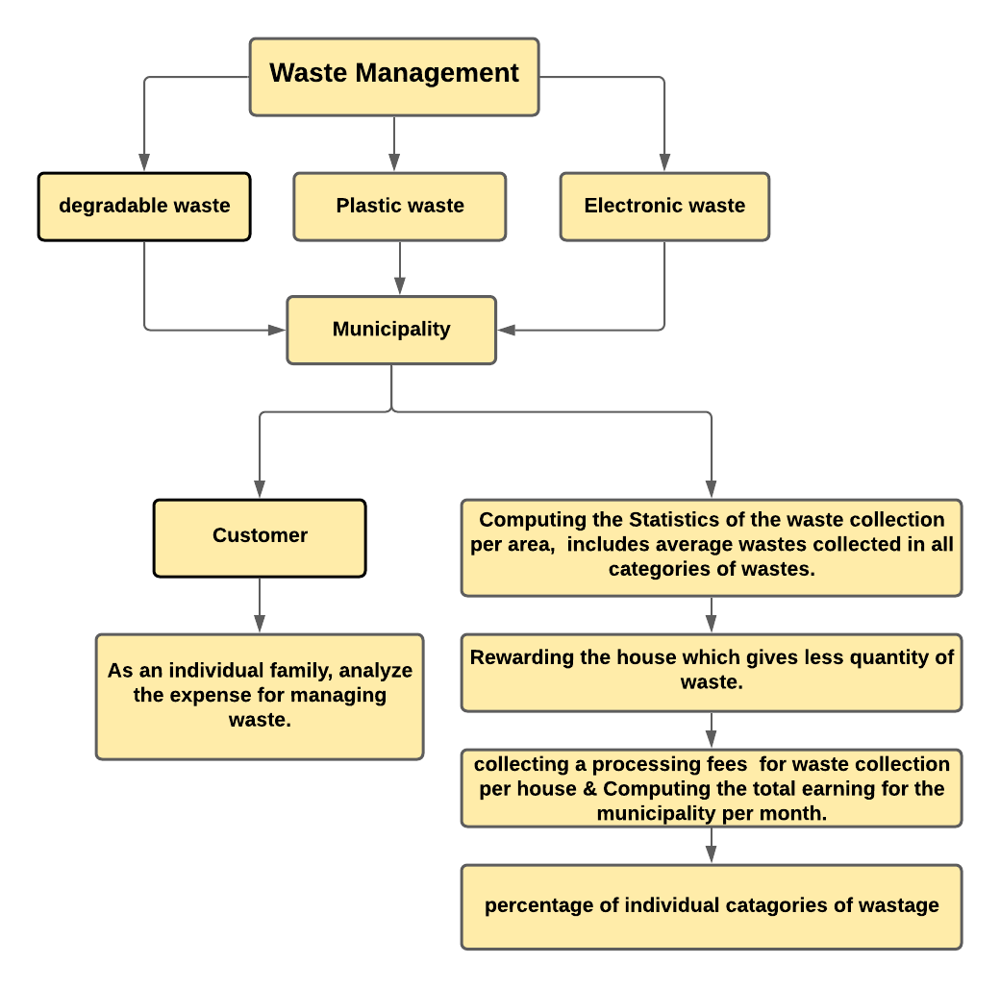

# Waste-Management:
## WHY IS PROPER WASTE MANAGEMENT IMPORTANT?
There’s more to proper waste disposal than keeping the environment clean. Tidy surroundings reduce health risks and hazards, resulting in a healthier community. It also supports local recycling efforts and sustainability.

Take a look at the importance of proper waste disposal for the environment, health, and sustainability.

#### Maintain Environmental Cleanliness

an average person produces hundreds of kilograms of waste every year. While we’re a long way from bringing it down to zero, each person can play a part in reducing waste production. A proper waste disposal system makes people more aware of how they can limit waste production and keep their surroundings clean.

#### Improve Community Health Standards

A clean environment is a sight for sore eyes. More than looking good, however, it means better air quality and less exposure to health hazards. Tidy surroundings can also have a positive influence on an individual’s mood and behaviour. This results in better health and quality of life for people in the community.

#### Support a More Sustainable Lifestyle

A proper waste disposal management makes it easier to segregate recyclable materials and reduce the amount of waste that ends up in landfills. People can reuse some of these things or sell them to manufacturers that use recyclable materials. This limits the need to buy new products and manufacture using new materials.
## Problem Statement:
#### A city municipality decided to collect wastes from residential area under its administration. Every day a truck with few employees go door to door for collecting waste from houses. Each day is assigned for particular type of waste (degradable waste, plastic waste and electronic waste).
1. Municipality computes the statistics of the waste collection per area. Statistics includes average wastes collected in all categories of wastes
2. Municipality has decided to reward the house which gives less quantity of waste.
3. Municipality decided to collect a processing fees (you can decide the amount based on the quantity and category of the waste) for waste collection per house. Compute the total earning for the municipality per month in this regard.
4. Show us what percentage of the waste is from what category.
5. As an individual family, analyze the expense for managing waste. Calculate the amount you are spending towards this.
#### Write an Algorithm and implement it using C-Programming for the above-mentioned scenario.
#### [To run the Program, Redirect to My Replit!](https://replit.com/@deepaksaip/waste-management#main.c)
## Functionalities:

FLOWCHART REPRESENTATION OF FUNCTIONALITIES 

## Instructions: 
1. Enter 1 for the functionalities of Municipal Authority:\
   Enter 2 for the functionality of consumer: 
2. Enter No of Areas 
3. Enter No of Houses 
4. Enter No of days 
5. If Option ‘1’ is chosen in Step 1\
           Enter one of the functionalities below\
 - 1. Calculate Average waste  
 - 2. Reward the House which gave lowest waste   
 - 3. Compute the Earnings of municipality  
 - 4. Check what percentage of the waste is from what category \
     Else if Option ‘2’ is chosen, the Program will Automatically proceed to functionality of “As an individual family, analyzing the expense for managing the waste” 
6. Enter Data of quantities for individual days and Houses of different houses. 
7. The program will display the output as per functionalities selected 
8. The Program will create the file named “output.txt” automatically & the output will be saved to it. 

## Testing:
### 1. Calculate Average waste: 
&nbsp;

Namaskar..! Welcome to Waste Management Calculator 

if you are consumer, please type 1 

if you are from Municipal Authority, please press 2:2 

Welcome back to Municipal Waste management calculator 

Please enter no of areas in the municipality:3 

Please enter no of houses in the area:4 

Please enter the no of days to be calculated:4 

If you want to computes the statistics of the waste collection per area, Please enter 1 

If you want to reward the house which gives less quantity of waste, please enter 2 

If you want to Compute the total earning for the municipality, please enter 3 

If you want to know what percentage of the waste is from what category, please enter 4:1 

 &nbsp;

ENTER THE DETAILS IN AREA 1 

enter the quantity of degradable waste in kg on day 1 

Enter quantity in house 1 :2 

Enter quantity in house 2 :1 

Enter quantity in house 3 :0.3 

Enter quantity in house 4 :2 

enter the quantity of degradable waste in kg on day 4 

Enter quantity in house 1 :0.2 

Enter quantity in house 2 :1 

Enter quantity in house 3 :3 

Enter quantity in house 4 :0.3 

enter the quantity of plastic waste in kg on day 2 

Enter quantity in house 1 :3 

Enter quantity in house 2 :2 

Enter quantity in house 3 :1 

Enter quantity in house 4 :3 

enter the quantity of electronic waste in kg on day 3 

Enter quantity in house 1 :2 

Enter quantity in house 2 :1 

Enter quantity in house 3 :3 

Enter quantity in house 4 :4 

 
&nbsp;
  

ENTER THE DETAILS IN AREA 2 

enter the quantity of degradable waste in kg on day 1 

Enter quantity in house 1 :1 

Enter quantity in house 2 :2 

Enter quantity in house 3 :2 

Enter quantity in house 4 :2 

enter the quantity of degradable waste in kg on day 4 

Enter quantity in house 1 :0.5 

Enter quantity in house 2 :3 

Enter quantity in house 3 :0.4 

Enter quantity in house 4 :4 

enter the quantity of plastic waste in kg on day 2 

Enter quantity in house 1 :1 

Enter quantity in house 2 :3 

Enter quantity in house 3 :3 

Enter quantity in house 4 :2 

enter the quantity of electronic waste in kg on day 3 

Enter quantity in house 1 :2 

Enter quantity in house 2 :0.4 

Enter quantity in house 3 :0.75 

Enter quantity in house 4 :3  

  &nbsp;

ENTER THE DETAILS IN AREA 3 

enter the quantity of degradable waste in kg on day 1 

Enter quantity in house 1 :2 

Enter quantity in house 2 :1 

Enter quantity in house 3 :3 

Enter quantity in house 4 :0.67 

enter the quantity of degradable waste in kg on day 4 

Enter quantity in house 1 :3.1 

Enter quantity in house 2 :2 

Enter quantity in house 3 :1 

Enter quantity in house 4 :2 

enter the quantity of plastic waste in kg on day 2 

Enter quantity in house 1 :4 

Enter quantity in house 2 :5 

Enter quantity in house 3 :0  

Enter quantity in house 4 :0 

enter the quantity of electronic waste in kg on day 3 

Enter quantity in house 1 :1 

Enter quantity in house 2 :2 

Enter quantity in house 3 :2 

Enter quantity in house 4 :1 

So Finally, Average waste in all Categories of waste in Municipality for 4 days in 3 Area/Areas is 29.54 kgs 

 &nbsp;
 &nbsp;

### 2. Rewarding the House which gives lowest waste 
&nbsp;

Namaskar..! Welcome to Waste Management Calculator 

if you are consumer, please type 1 

if you are from Municipal Authority, please press 2:2 

Welcome back to Municipal Waste management calculator 

Please enter no of areas in the municipality:2 

Please enter no of houses in the area:3 

Please enter the no of days to be calculated:5 

If you want to computes the statistics of the waste collection per area, Please enter 1 

If you want to reward the house which gives less quantity of waste, please enter 2 

If you want to Compute the total earning for the municipality, please enter 3 

If you want to know what percentage of the waste is from what category, please enter 4:2 
&nbsp;

ENTER THE DETAILS IN AREA 1 

enter the quantity of degradable waste in kg on day 1 

Enter quantity in house 1 :1.2 

Enter quantity in house 2 :3.4 

Enter quantity in house 3 :5.2 

enter the quantity of degradable waste in kg on day 4 

Enter quantity in house 1 :3.2 

Enter quantity in house 2 :1.8 

Enter quantity in house 3 :4.1 

enter the quantity of plastic waste in kg on day 2 

Enter quantity in house 1 :5.3 

Enter quantity in house 2 :2.1 

Enter quantity in house 3 :3.6 

enter the quantity of plastic waste in kg on day 5 

Enter quantity in house 1 :6.1 

Enter quantity in house 2 :5 

Enter quantity in house 3 :4.7 

enter the quantity of electronic waste in kg on day 3 

Enter quantity in house 1 :3 

Enter quantity in house 2 :4.2 

Enter quantity in house 3 :2.6 

House 1 gives 4.40 kgs degradable waste  

House 2 gives 5.20 kgs degradable waste  

House 3 gives 9.30 kgs degradable waste  

The house which gives low quantity of degradable waste is rewarded with badminton kit i.e house 1 with 4.40 kgs bio degradable waste 

House 1 gives 11.40 kgs plastic waste  

House 2 gives 7.10 kgs plastic waste  

House 3 gives 8.30 kgs plastic waste  

The house which gives low quantity of plastic waste is rewarded with cricket kit i.e house 2 with 7.10 kgs plastic waste  

House 1 gives 3.00 kgs electronic waste  

House 2 gives 4.20 kgs electronic waste  

House 3 gives 2.60 kgs electronic waste  

The house which gives low quantity of electronic waste is rewarded with footbal kit i.e house 3 with 2.60 kgs electronic waste 

  
&nbsp;
  

ENTER THE DETAILS IN AREA 2 

enter the quantity of degradable waste in kg on day 1 

Enter quantity in house 1 :3 

Enter quantity in house 2 :4.1 

Enter quantity in house 3 :2.1 

enter the quantity of degradable waste in kg on day 4 

Enter quantity in house 1 :5.2 

Enter quantity in house 2 :4 

Enter quantity in house 3 :4.3 

enter the quantity of plastic waste in kg on day 2 

Enter quantity in house 1 :4.1 

Enter quantity in house 2 :2.9 

Enter quantity in house 3 :5.1 

enter the quantity of plastic waste in kg on day 5 

Enter quantity in house 1 :3 

Enter quantity in house 2 :2.6 

Enter quantity in house 3 :3.2 

enter the quantity of electronic waste in kg on day 3 

Enter quantity in house 1 :4 

Enter quantity in house 2 :3.2 

Enter quantity in house 3 :5 

House 1 gives 8.20 kgs degradable waste  

House 2 gives 8.10 kgs degradable waste  

House 3 gives 6.40 kgs degradable waste  

The house which gives low quantity of degradable waste is rewarded with badminton kit i.e house 3 with 6.40 kgs bio degradable waste 

House 1 gives 7.10 kgs plastic waste  

House 2 gives 5.50 kgs plastic waste  

House 3 gives 8.30 kgs plastic waste  

The house which gives low quantity of plastic waste is rewarded with cricket kit i.e house 2 with 5.50 kgs plastic waste  

House 1 gives 4.00 kgs electronic waste  

House 2 gives 3.20 kgs electronic waste  

House 3 gives 5.00 kgs electronic waste  

The house which gives low quantity of electronic waste is rewarded with footbal kit i.e house 2 with 3.20 kgs electronic waste 

&nbsp;
&nbsp;

### 3. Computing the Earnings of municipality 
&nbsp;

Namaskar..! Welcome to Waste Management Calculator 

if you are consumer, please type 1 

if you are from Municipal Authority, please press 2:2 

Welcome back to Municipal Waste management calculator 

Please enter no of areas in the municipality:2 

Please enter no of houses in the area:3 

Please enter the no of days to be calculated:5 

If you want to computes the statistics of the waste collection per area, Please enter 1 

If you want to reward the house which gives less quantity of waste, please enter 2 

If you want to Compute the total earning for the municipality, please enter 3 

If you want to know what percentage of the waste is from what category, please enter 4:3 
&nbsp;

ENTER THE DETAILS IN AREA 1 

enter the quantity of degradable waste in kg on day 1 

Enter quantity in house 1 :1 

Enter quantity in house 2 :2 

Enter quantity in house 3 :3 

enter the quantity of degradable waste in kg on day 4 

Enter quantity in house 1 :2 

Enter quantity in house 2 :3 

Enter quantity in house 3 :1 

enter the quantity of plastic waste in kg on day 2 

Enter quantity in house 1 :1 

Enter quantity in house 2 :2 

Enter quantity in house 3 :3 

enter the quantity of plastic waste in kg on day 5 

Enter quantity in house 1 :3 

Enter quantity in house 2 :2 

Enter quantity in house 3 :1 

enter the quantity of electronic waste in kg on day 3 

Enter quantity in house 1:1 

Enter quantity in house 2:2 

Enter quantity in house 3:3 

  &nbsp;

ENTER THE DETAILS IN AREA 2 

enter the quantity of degradable waste in kg on day 1 

Enter quantity in house 1 :4 

Enter quantity in house 2 :5 

Enter quantity in house 3 :6 

enter the quantity of degradable waste in kg on day 4 

Enter quantity in house 1 :1 

Enter quantity in house 2 :2 

Enter quantity in house 3 :3 

enter the quantity of plastic waste in kg on day 2 

Enter quantity in house 1 :4 

Enter quantity in house 2 :6 

Enter quantity in house 3 :5 

enter the quantity of plastic waste in kg on day 5 

Enter quantity in house 1 :1 

Enter quantity in house 2 :2 

Enter quantity in house 3 :6 

enter the quantity of electronic waste in kg on day 3 

Enter quantity in house 1:1 

Enter quantity in house 2:23 

Enter quantity in house 3:2 

So Finally, Total Earnings of the Municipality for 5 days in 2 Area/Areas is ₹1005.00 

 &nbsp;
 &nbsp;

### 4. Checking what percentage of the waste is from what category 
&nbsp;

Namaskar..! Welcome to Waste Management Calculator 

if you are consumer, please type 1 

if you are from Municipal Authority, please press 2:2 

Welcome back to Municipal Waste management calculator 

Please enter no of areas in the municipality:2 

Please enter no of houses in the area:4 

Please enter the no of days to be calculated:5 

If you want to computes the statistics of the waste collection per area, Please enter 1 

If you want to reward the house which gives less quantity of waste, please enter 2 

If you want to Compute the total earning for the municipality, please enter 3 

If you want to know what percentage of the waste is from what category, please enter 4:4 
&nbsp;

ENTER THE DETAILS IN AREA 1 

enter the quantity of degradable waste in kg on day 1 

Enter quantity in house 1 :1 

Enter quantity in house 2 :2 

Enter quantity in house 3 :3 

Enter quantity in house 4 :4 

enter the quantity of degradable waste in kg on day 4 

Enter quantity in house 1 :1 

Enter quantity in house 2 :3 

Enter quantity in house 3 :4 

Enter quantity in house 4 :5 

enter the quantity of plastic waste in kg on day 2 

Enter quantity in house 1 :1 

Enter quantity in house 2 :2 

Enter quantity in house 3 :3 

Enter quantity in house 4 :4 

enter the quantity of plastic waste in kg on day 5 

Enter quantity in house 1 :5 

Enter quantity in house 2 :2 

Enter quantity in house 3 :3 

Enter quantity in house 4 :4 

enter the quantity of electronic waste in kg on day 3 

Enter quantity in house 1:1 

Enter quantity in house 2:2 

Enter quantity in house 3:3 

Enter quantity in house 4:5 

  
&nbsp;
  

  

ENTER THE DETAILS IN AREA 2 

enter the quantity of degradable waste in kg on day 1 

Enter quantity in house 1 :1 

Enter quantity in house 2 :3 

Enter quantity in house 3 :5 

Enter quantity in house 4 :6 

enter the quantity of degradable waste in kg on day 4 

Enter quantity in house 1 :4 

Enter quantity in house 2 :6 

Enter quantity in house 3 :5 

Enter quantity in house 4 :2 

enter the quantity of plastic waste in kg on day 2 

Enter quantity in house 1 :1 

Enter quantity in house 2 :5 

Enter quantity in house 3 :6 

Enter quantity in house 4 :3 

enter the quantity of plastic waste in kg on day 5 

Enter quantity in house 1 :5 

Enter quantity in house 2 :3 

Enter quantity in house 3 :6 

Enter quantity in house 4 :4 

enter the quantity of electronic waste in kg on day 3 

Enter quantity in house 1:5 

Enter quantity in house 2:6 

Enter quantity in house 3:4 

Enter quantity in house 4:6 

total wastage is 144.00 KGS 

38.19 % is from degradable waste category 

39.58 % is from plastic waste category 

22.22 % is from electronic waste category 

 
&nbsp;
 &nbsp;

### 5. As an individual family, analyzing the expense for managing the waste 
&nbsp;

Namaskar..! Welcome to Waste Management Calculator 

if you are consumer, please type 1 

if you are from Municipal Authority, please press 2:1 

Now, You're entering as a customer 

Please enter the no of days to be calculated:8 

enter the quantity of degradable waste in kg on day 1:1 

enter the quantity of degradable waste in kg on day 4:2 

enter the quantity of degradable waste in kg on day 7:3 

enter the quantity of plastic waste in kg on day 2:5 

enter the quantity of plastic waste in kg on day 5:6 

enter the quantity of plastic waste in kg on day 8:4 

enter the quantity of electronic waste in kg on day 3:2 

enter the quantity of electronic waste in kg on day 6:3 

Total expenditure on waste management for 8 days is ₹255.00 
&nbsp;

###  THE END 

[Respective C program is Uploaded here :relaxed:!](https://github.com/deepaksaipendyala/waste-management/blob/master/main.c)

Feel free to understand and implement in your own way!!

@author --DEEPAK SAI PENDYALA--
